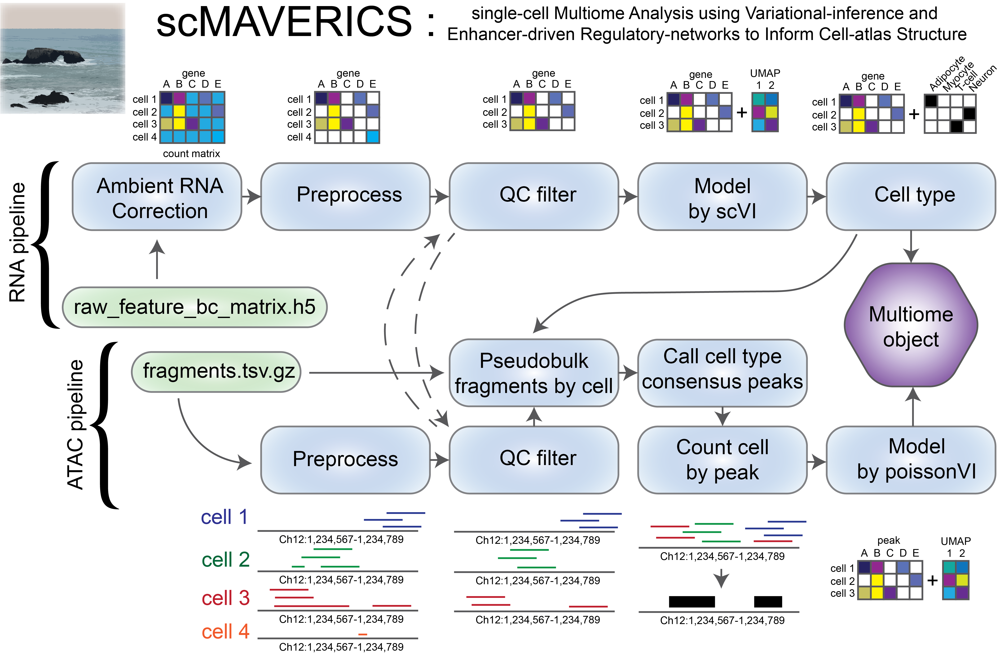

# scMAVERICS

## single-cell Multiome Analysis using Variational-inference and Enhancer-driven Regulatory-networks to Inform Cell-atlas Structure

Disclaimer: This pipeline is built to run with large (>100 sample) datasets on the Slurm HPC at the NIH (Biowulf).

Focus on the analysis, not the processing. 

The workflow was built to minimize the time required to process data and get the single-cell scientist analyzing high-quality processed data and generating figures. We tried to strike a balance between giving the user control. The scripts and Snakemake pipeline work for the Multiome datasets output from the 10X Multiome kit (https://www.10xgenomics.com/support/epi-multiome), generated by the Single Cell Expert group at Center for Alzheimer's and Related Dementias at the NIH. The multiome pipeline was built to take several batches of human brain single-nuclei sequencing samples and process them into a multiome atlas object for further analysis. 
 
The modules of Scanpy (https://github.com/scverse/scanpy), SCVI (https://github.com/scverse/scvi-tools), snapATAC2 (https://github.com/kaizhang/SnapATAC2), pycisTopic (https://github.com/aertslab/pycisTopic), and MACS (https://github.com/macs3-project/MACS) are utilized heavily to produce a multiome atlas with minimal batch effects. 

## Pipeline

### To get started

Copy this repository to where you will be working with your data. This folder will be where output data is stored, while intermediary files will be stored in a separate folder to be defined by the user. It is important that the output of your CellRanger-ARC run has the format: `<data_dir>/<sample>/`!

### Required inputs:
- Metadata file in .csv format, example in `input/example_metadata.csv`. A minimal metadata file should include:
  - Sequencing batch, called Use_batch in example (indicating the separate sequencing folder for each run of `CellRanger-ARC`, denoted batch"Sequencing batch>")
  - Sample ID, called Sample in the example, indicates where name of each sample
  - Sample comparison, usually a disease or diagnosis, called 'Primary Diagnosis' in the example, as well for the values of this column;
    - Names of the control condition, called 'control' in the example
    - A list of conditions to compare to the control, called 'diseases' in the example
- Cell-typing table with marker genes, in .csv format, see example in `input/example_marker_genes.csv`
- Directory of the CellRanger output, the data here is the output of `CellRanger`, the raw data required includes;
    - `data_dir/{sample}/raw_feature_bc_matrix.h5`
    - `data_dir/{sample}/atac_fragments.tsv.gz`
    - `data_dir/{sample}/atac_possorted_bam.bam`
 
In addition, the `snakefile` requires modifications to fit your project. The top section "Parameter" should be modified for your dataset, include quality control values, where the input metadata and cell/cell gene marker files are stored. Input files should have their values match the parameters section.

### Outputs:
- RNA and ATAC Multiome atlas object
- DEG tables
- DAR tables
- Motif enrichment
- Footprinting results
- Co-accessibility networks
- Functional enrichment (GSEA, GREAT)

### Current version:
- Uses Singularity images for reproducible runs (scVI and poissonVI modeling will be fast utilizing a GPU-enabled environment)
- Snakemake runs steps until all output files are created
- Genes used for celltyping are input from `input/example_marker_genes.csv`
- Both RNA and ATAC processing has to be done to run this pipeline 
- Data needs to be stored in a specific heirarchy
- Cellbender needs to be run after CellRanger to compensate for ambient RNA
- Differential Gene Expression and Differential Accessibility of Regions analysis are done 

Once set up, this complete pipeline can be run by simply typing `bash snakemake.sh` in terminal in an HPC running Slurm. This is a work in progress and has not been tested on other devices. 

# Pipeline Steps

## RNA Steps

### RNA (Transcriptomic) Preprocessing
- Ambient RNA correction (Cellbender)
- Per-Sample RNA Processing
  - Creation of per-sample AnnData objects in Scanpy
  - Metadata integration
    - Gene counts
    - %Mt and %Rb
    - Doublet score (scrublet)  
- QC filtering (%Mt, %Rb, doublet score, min. # genes)
- Merge filtered samples  

### RNA Dimensionality Reduction & Annotation
- Feature Selection & Modeling
  - Highly variable gene selection 
  - GPU-enabled scVI modeling (two-stage: initial & after cluster/cell-type QC)
  - UMAP dimensionality reduction and leiden clustering  
- Cell-Type Annotation
  - Marker-based annotation
  - Leiden-cluster QC
  - Cell-type specific QC
  - Rerun feature selection and modeling  

### RNA-Based Data Analysis
- Pseudobulking by cell-type 
- Differential Expression
- Regression Analyses
- Gene set enrichment analysis (GSEA)
- Cell-cell communication

## ATAC steps

### ATAC (Chromatin Accessibility) Preprocessing
- Per-Sample ATAC Processing
  - Create ATAC AnnData objects from fragment files
  - Metadata integration
    - Fragment counts
    - TSSE score
- ATAC-specific QC visualization
  - Min. number of fragments
- Joint RNA–ATAC filtering per sample
- Merge filtered samples  

### Peak Calling & Chromatin Modeling

- Sort ATAC fragments by cell-type, subtype
  - Generate bigWig tracks (raw + normalized)
- Call ATAC peaks via MACS2
  - cell-type +/- disease state
- Consensus peak calling across cell-types
- Merge and count peaks into cellxpeak AnnData object
- Dimensionality reduction with PoissonVI

### Cell-Type–Specific ATAC Analyses

- Pseudobulk ATAC matrices produced for each comparison
- Differential Accessibility (DAR)
- Co-accessibility Networks
- Cicero/CIRCE used to infer co-accessible peak networks
- CCAN (cis-co-accessibility network) modules extracted
- DARs mapped onto CCANs

### Regulatory & Motif Analyses (Beyond Transcriptomics)

- Global and differential motif enrichment using JASPAR motifs
Motifs tested within DARs
- ATAC Footprinting (TOBIAS)
  - ATACorrect bias correction
  - Footprint scoring
  - Differential footprinting

### Functional Interpretation of ATAC Results

- GREAT Analysis
- Map DARs to nearby genes
- Ontology and pathway enrichment for regulatory regions
- Cell-type- and disease-specific GREAT outputs

## Multiome Integration & Final Outputs
- RNA + ATAC merged into a MuData object

